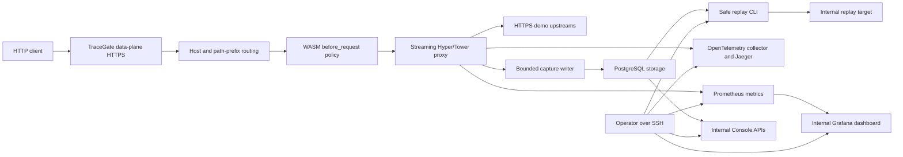

# TraceGate Architecture

## Runtime Shape

- GCP Compute Engine VM.
- Docker Compose under systemd.
- Public port: TraceGate HTTPS data-plane `8080`.
- Internal-only services: admin, Console APIs, PostgreSQL, Prometheus, Jaeger, Grafana, and replay target.
- Release-quality verification temporarily resizes the app VM to `n2-standard-16` and creates a separate `n2-standard-8` load generator.
- Cleanup deletes the load generator and resizes the app VM back to `e2-micro`.

## Data Flow

1. TraceGate accepts HTTPS traffic.
2. The gateway assigns or propagates `x-request-id` and W3C trace context.
3. Route matching selects the longest host-aware prefix.
4. WASM policy plugins allow, deny, or mutate request headers.
5. The proxy streams to an upstream and returns the response.
6. Metadata, selected redacted headers, bounded body captures, plugin decisions, replay runs, metrics, and traces are recorded.
7. Operators inspect evidence through SSH-only internal services and CLI commands.
